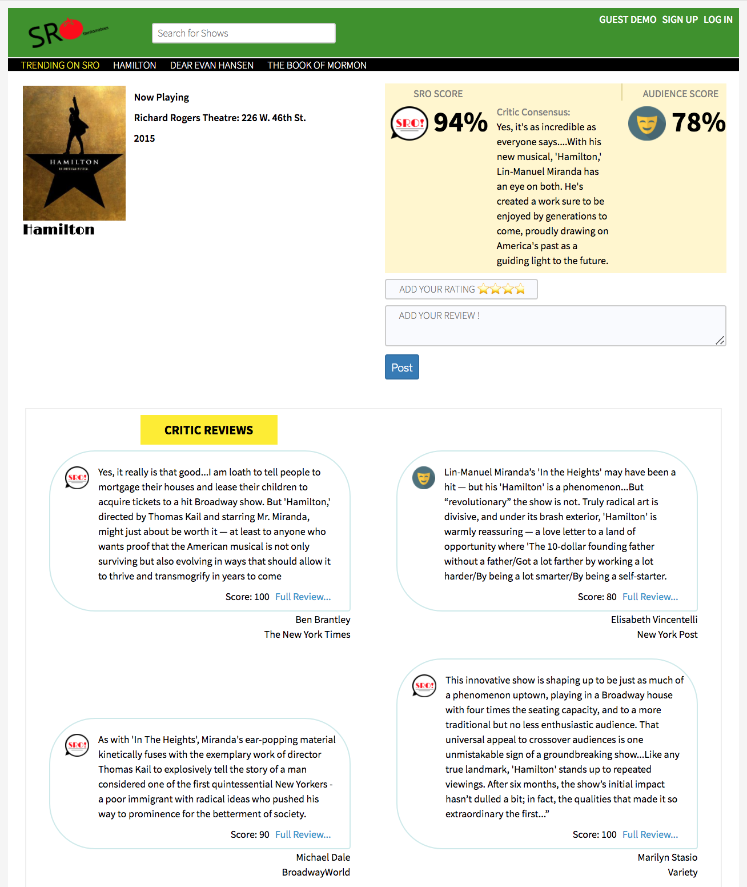

# SRO
[SRO live](https://sro-ttentomatoes.herokuapp.com)

SRO is a full-stack web application inspired by Rotten Tomatoes. It utilizes Ruby on Rails on the backend with a PostgreSQL database, using React and Redux on the front end.

## Features & Implementation

### SRO Score
Rather than shows relying solely on the weight of 1 review, SRO creates an aggregate score of all of the reviews for a particular show.  A show gets a rating of SRO if its score is 85 or higher, Excellent (comedey mask) if its score is 60 or higher, and Disappointing (tragedy mask) for 59 and below.

### Index of Shows

The main page of SRO contains a list of all the Plays now on Broadway, all the Musicals now on Broadway, and all the shows that are coming soon. Each show now playing also comes with its SRO score.

### Shows Page

Each show has it's own page containing its show status, theater information, SRO score, Audience score, Critic Reviews and User Reviews.

### User Review

On each Shows page, a user can leave a review and a score for that show.

### Single page

SRO is a single page app which makes for quick navigation between components

## Future Functionality for the Project

### Searchbar

As the database continues to grow, searching line by line through an index of Shows will become tedious. The searchbar will live inside the navigation component and will be available on every page.  This will allow the user to navigate from show to show with ease.
